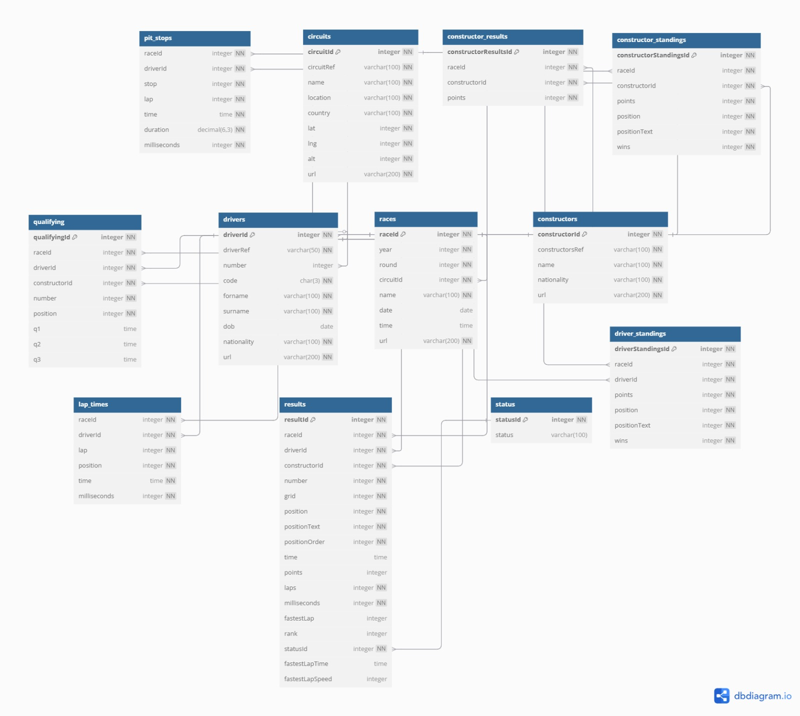

---
hide:
  - navigation
---

# Modelo Entidade-Relacionamento (ER)

## Diagrama ER

> Abaixo está o diagrama que representa graficamente o modelo entidade-relacionamento com suas tabelas e relacionamentos:

> 💡 O modelo foi criado com base nos dados disponíveis no dataset.

---

## Tabelas

- **drivers**: Informações sobre os pilotos.
- **constructors**: Informações sobre as equipes (construtores).
- **races**: Cada corrida realizada no campeonato, com referência ao circuito, data e ano.
- **circuits**: Dados sobre os circuitos onde as corridas ocorrem.
- **results**: Resultado de cada piloto em uma corrida.
- **lap_times**: Tempos de cada volta de cada piloto em cada corrida.
- **pit_stops**: Informações sobre as paradas nos boxes.
- **status**: Classificações do resultado de uma corrida (ex: `Finished`, `Collision`, `Accident`, etc).
- **constructor_results**: Resultados por equipe em cada corrida, com pontos obtidos.
- **constructor_standings**: Classificação final das equipes no campeonato, com pontos, posição e vitórias.
- **qualifying**: Tempos registrados nas sessões classificatórias que determinam o grid de largada.
- **driver_standings**: Classificação final dos pilotos no campeonato, com pontuação, vitórias e posição.

---

As tabelas foram criadas em um banco **SQL Server**, com suas respectivas chaves primárias e estrangeiras. Essa base foi utilizada como **fonte da camada landing** na pipeline de dados.

---
