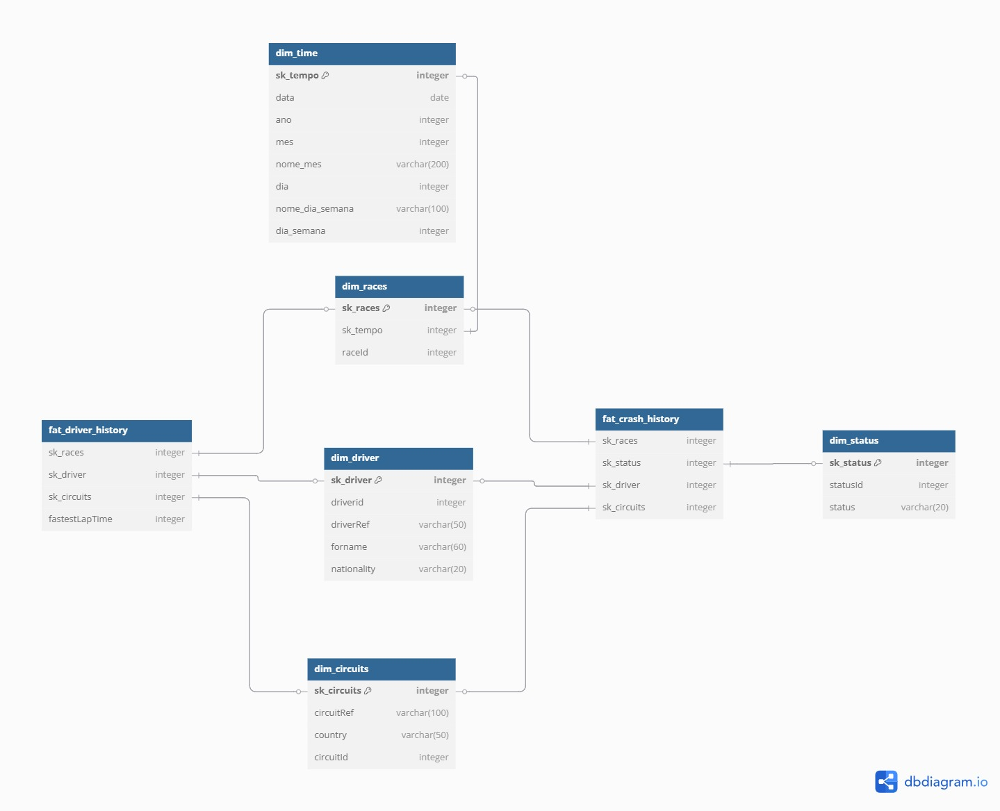

---
hide:
  - navigation
---

# Modelo Dimensional

## Estrutura do Modelo

Adotamos a **modelagem em estrela (star schema)**, com tabelas de fatos ligadas a suas respectivas dimensões. A modelagem foi realizada com base nos dados da camada **Gold**, processados e organizados no Databricks.

---

> 💡 Abaixo está o diagrama representando as tabelas fato e suas dimensões:

## Fato: `fat_driver_history`

Representa o histórico de voltas de cada piloto por circuito.

## Fato: `fat_crash_history`

Armazena os registros de acidentes e colisões por piloto e pista.

---

## Dimensões

### `dim_driver`

Contém os dados dos pilotos.

### `dim_circuits`

Contém os dados dos circuitos.

### `dim_races`

Representa as corridas do campeonato.

### `dim_status`

Classificações finais dos pilotos em uma corrida.
