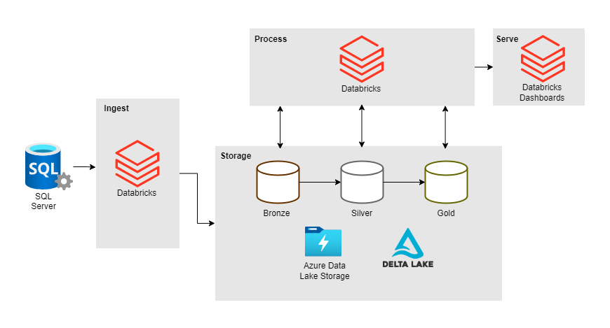

# Pipeline de Dados – Fórmula 1

[](https://iurilimamarques.github.io/projeto-final-engenharia-dados/)  

Repositório do projeto final da disciplina de Engenharia de Dados do curso de Engenharia de Software da UNISATC. Utilizamos dados históricos da Fórmula 1 para construir uma pipeline de dados completa, da ingestão à visualização de KPIs.

---

## Desenho de Arquitetura



---

## Pré-requisitos e Ferramentas Utilizadas

- **SQL Server**: Banco relacional para ingestão inicial
- **Azure Data Lake**: Armazenamento em nuvem das camadas de dados
- **Databricks + PySpark**: Processamento e transformação dos dados
- **Delta Lake**: Controle de versionamento e transações ACID
- **Terraform**: Provisionamento da infraestrutura em nuvem (incluindo banco SQL e Data Lake)
- **MkDocs + Material**: Documentação do projeto

---

## Como Executar

O projeto roda majoritariamente em ambiente de nuvem (Azure + Databricks). Para reprodução do ambiente e execução da pipeline, siga o passo a passo abaixo:

### 1. Clonar o repositório do projeto:
```bash
git clone https://github.com/iurilimamarques/projeto-final-engenharia-dados.git
```

### 2. Provisionar a infraestrutura via Terraform

O Terraform deste projeto já contempla a criação dos principais recursos, incluindo a instância do banco de dados SQL Server e a conta de armazenamento do Data Lake.  
No diretório onde estão os arquivos do Terraform, execute:
```bash
terraform init
terraform validate
terraform fmt
terraform plan
terraform apply
```

### 3. Executar os scripts de criação e inserção de tabelas

Após a criação da infraestrutura, localize os scripts SQL na pasta [`SQL/`](SQL/) e execute-os na instância do SQL Server provisionada para criar as tabelas e inserir os dados necessários.

### 4. Provisionar um cluster do Databricks

Crie uma conta no Databricks e provisione um cluster no workspace associado à sua assinatura Azure.

### 5. Integrar o Databricks com o Azure Data Lake

Realize a integração entre o Databricks e o Azure Data Lake, garantindo que o cluster Databricks tenha permissão de acesso ao armazenamento criado.

### 6. Executar a pipeline de dados

Executar a pipeline de dados conforme scripts.

---

## Autores

- [Ana Beatriz](https://github.com/AnaBeatrizMeller)
- [Iuri](https://github.com/iurilimamarques)
- [Julia](https://github.com/juliameller) 
- [Lucas](https://github.com/Lucaspaixao-code)
- [William](https://github.com/WilliamEspindolaCardoso)

---

## Licença

Este projeto está sob a licença **MIT**.  
[](LICENSE)

---

## Referências

- Dataset: [Formula 1 World Championship (1950 - 2024) – Kaggle](https://www.kaggle.com/datasets/rohanrao/formula-1-world-championship-1950-2020)
- Scripts [Terraform](https://github.com/jlsilva01/adls-azure/)